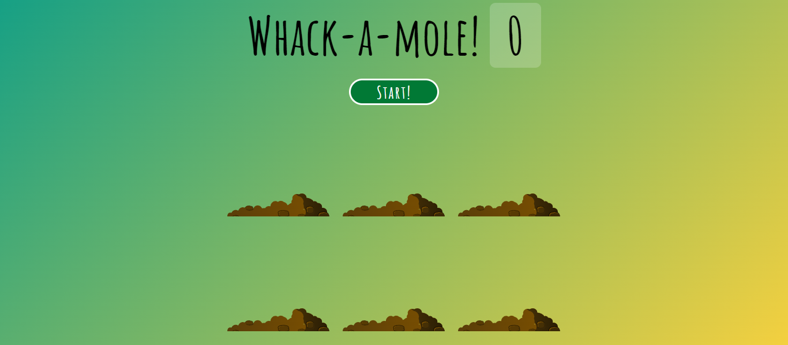

# Whack-A-Mole

## Table of contents

- [Overview](#overview)
  - [Description](#description)
  - [Screenshot](#screenshot)
  - [Links](#links)
- [My Process](#my-process)
  - [Built with](#built-with)
  - [What I Learned](#what-i-learned)
  - [Continued development](#continued-development)
  - [Useful resources](#useful-resources)
- [Author](#author)

## Overview

### Description

This website is a game which consists of six dirt holes and a mole. The mole pops up from the holes
randomly and player has to click on the mole to get points. The points are displayed at the top of the
page.

### Screenshot

### Links

Live Site URL: https://shubhamkumar3110.github.io/Whack-A-Mole/

## My Process

### Built with

- HTML
- CSS
- JavaScript

### What I Learned

I learned to work with simple flex box properties.

### Continued development

I will be focusing on building responsive web pages.

### Useful resources

[Wes Bos](https://wesbos.com/) - I followed the tutorials provided by Wes Bos. He teaches a lot of simple projects focused on javascript.

## Author
Shubham Kumar
